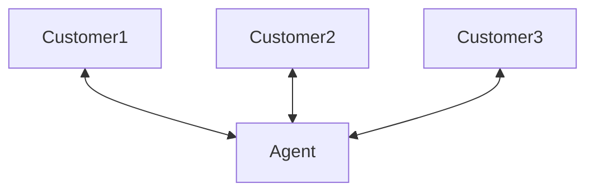
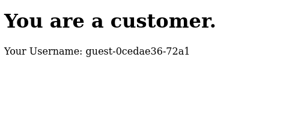
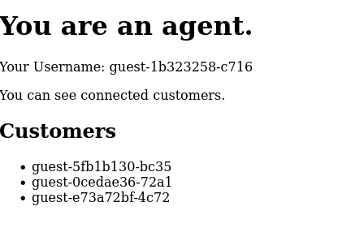

# Presence API

ApiRTC embeds a presence mecanism to manage a list of connected contacts. 

# Run this example
This example set the scene for an agent-customer relationship. 

1. Start a simple HTTP server serving page of this folder
2. Open one or several tabs on `localhost/` to load the "Customer" interface.

1. Go to `localhost/agent.html` to load the "Agent interface

As you open more tabs/close tab of the Customer interface, the agent interface will react accordingly. 

# More infos
Go on [the ApiRTC developer portal](https://dev.apirtc.com) for more information on Presence management.